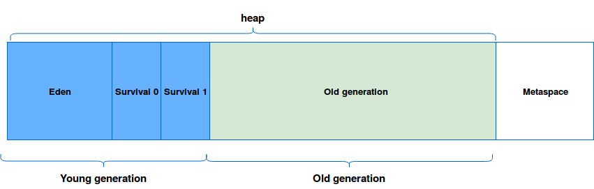

# gc

## 주요 개념

GC(garbage collector)란?

가비지 수집기라고 하여 heap 메모리에 할당한 객체를 자동으로 해제해준다. 

과거 C계열 프로그램을 예를들면, 객체를 할당할 떄 new 키워드로 메모리에 할당하고, free나 delete 메서드로 메모리를 직접 해제 해줘야 했다.

하지만 직접 해주긴 번거럽고, 휴먼에러로 인해 해제를 하지 않았다면 메모리 누수로 이어졌다.

그래서 애플리케이션 동작동안 자동으로 메모리를 해제해주는 GC라는 개념이 등장했다. 그래서 개발자는 번거롭게 메모리를 해제해줄 필요가 없어가지고, 휴먼에러로 인해 OOM(Out Of Memory Error)이 발생하는 이슈가 줄었다.

&ast; 다만 자동으로 해주는 장점은 있지만, 나중에 나올 STW(애플리케이션이 멈춤)라는 개념으로 실시간 프로그래밍에 적합하지 않다. 

## GC 구조 

왜 이런 구조일까?

메모리 특징상, 최근에 할당된 메모리가 빠른시간 내에 해제된다는 가설로 설계 됐다.
최근에 할당되는 young generation과 오래된 객체인 old generation을 나눈다. 
관심사를 나눠(minor, major) 메모리를 효율적으로 사용한다. 모든 객체를 매번 탐색하는 것보다, 신규객체만 탐색하여 해제하는게 목적이다.

## 주요 용어 

eden 영역: 처음 객체가 생성되어 할당되는 공간

survivor 영역: 마이너 gc가 일어날 때, eden 혹은 다른 survivor 영역에서 이동됨. 각 객체는 age를 갖고 있음.

old generation: survivor영역에서 일정 임계값(age)을 넘으면, old generation으로 이동된다. (이걸 promoted라고 함)
임계값은 `MaxTenuringThreshold`로 설정할 수 있다. g1gc와 패러럴 GC는 기본이 15이다.

minor gc: eden 영역이 꽉 찬 경우 발생. 더이상 참조되지 않는 객체를 정리하고, suvival 영역으로 이동시킨다. 
major gc(full gc): old generation 영역이 부족한 경우 발생. 일반적으로 비용이 크다.

Stop the world: GC작업으로 인하여 애플리케이션이 멈추는 걸 뜻함.

mark and sweep (compact): 

## 주요 GC
- Serial GC
- Parallel GC (java 8 default)
- G1GC (java 9 default)
- ZGC
