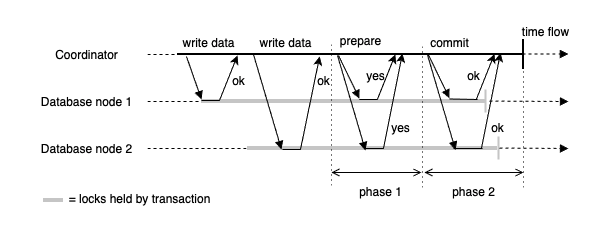
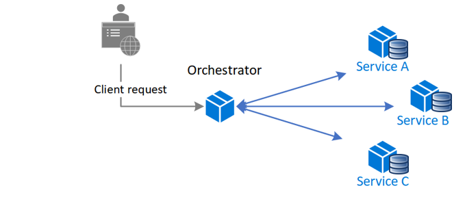
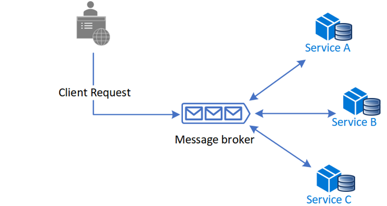

# SAGA 패턴
SAGA 패턴은 마이그로서비스에서 일관성을 맞추는 방법.

## 왜 쓰는가?
MSA에서 여러 리소스의 변경을 하나의 트랜잭션을 묶어야할 니즈가 생긴다. 

예를들어 분산된 서비스인 결제시스템에서 결제를 진행할 때, 분리되어있는 포인트와 쿠폰을 함께 사용하는 걸 예로 들 수 있다.

즉 분산환경에서 트랜잭션(정합성)을 보장하기 위해 사용한다.

## 대안
데이터베이스의 투 페이즈 커밋을 사용한다. 여러 노드의 데이터베이스의 원자성을 맞추기 위한 프로토콜이라고 볼 수 있다.

코디네이터(일반적으로 애플리케이션 서버)과 2개 이상의 데이터베이스가 참여한다. 코디네이터 중점으로 여러개의 데이터베이스 싱크를 맞출 수 있다.
몇가지 문제점이 있다. 코디네이터 서버가 죽는다면, 중간에 commit, abort 명령을 기다리는 데이터베이스는 무한정 대기해야한다.
또 no-sql이나 메시지 브로커에서 프로토콜을 지원하지 않는다면, 사용할 수 없다.

## 종류

### Orchestration based saga

하나의 지휘자 애플리케이션이 트랜잭션을 조정한다. 중앙의 컨트롤러가 각개의 트랜잭션을 컨트롤할 수 있다.

1. 지휘자 애플리케이션이 중앙 Controller가 되어, 로컬 트랜잭션을 시작한다.
2. 지휘자가 원자성에 필요한 마이크로 서비스를 순차적으로 호출한다.
3. 로컬트랜잭션 종료.

실패하는 유스케이스는 아래와 같다.

1. 지휘자가 로컬트랜잭션을 시작한다.
2. A 서비스에 호출
3. B 서비스를 호출하는 중 예외 발생. 
4. 지휘자는 rollback으로 판단하고, A 서비스에 롤백 요청
5. 트랜잭션 종료

그래서 Orchestration를 제외한 마이크로서비스는 트랜잭션이 실패했을 때 롤백할 수 있는 기능도 제공해야한다.

**장점**
- 순환참조가 방지된다. (SAGA 참가자가 오케스트레이터를 의존)
- SAGA 참가자의 비즈니스가 명확히 분리됨.

**단점**
- 단일 장애 지점(SPOF)이 오케스트레이터에서 발생할 수 있음

### Choreography based saga 

orchestration based saga의 중앙 집중형 아키텍쳐의 단점을 인식하고 나온 기법.
각각의 마이크로서비스가 안무(choreography)를 갖고 있다. 

1. 처리할 트랜잭션이 성공/실패에 따라 메시지를 발행한다.
2. 각각의 연관된 마이크로 서비스는 해당 메시지를 구독하여, 메시지에 해당하는 작업을 진행한다. (그 작업이 또 메시지를 발행할 수도 있다.)

위 처럼 각 마이크로서비스의 성공/실패에 따라 메시지를 발행함으로써, 중앙집중화된 트랜잭션의 단점과 서비스간 결합도를 낮출 수 있다.

메시지 드리븐 아키텍쳐와 비슷하다고 느꼈는데, choreography based saga는 메시지 드리븐에 포함되는데 트랜잭션에 집중된 아키텍처라고 볼 수 있다.

**장점**
- 서비스간 의존성을 느슨하게 가져갈 수 있다.
- 스케일링이 독립적으로 가능하다.

**단점**
- SAGA 참여자가 많아짐에 따라 이벤트가 많아져, 복잡도가 올라간다.
- 시나리오가 복잡해짐에 따라 롤백이 어려울 수도 있다.

# 출처
https://dongwooklee96.github.io/post/2021/03/26/two-phase-commit-%EC%9D%B4%EB%9E%80/
https://learn.microsoft.com/ko-kr/azure/architecture/reference-architectures/saga/saga