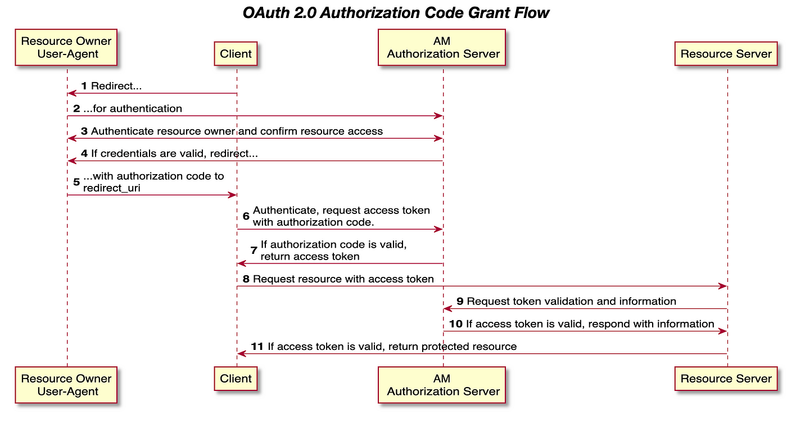

## OAuth2에서 authorization code는 왜 필요한가?

위 사진처럼 리소스오너가 인증을 마친 후, authorization code를 받고 access token을 받기 위해 핸드쉐이크한다.

처음보기에는 불필요한 과정이라고 생각했다. 해당 과정이 없는 Implicit 플로우를 사용하면 되는데, 왜 코드-액세스토큰 핸드쉐이크를 하는걸까?

stackoverflow에서 아래같은 답변이 있다.

authorization code를 쓰는 이유는 아래와 같다고 한다.
1. 모든 개발자가 SSL로 구성된 서버(사진상 Application 영역)를 제공하지 않는다. 
2. 해커들이 요청을 가로채, 액세스/리프레시토큰을 탈취하는 것을 방지한다.

**authorization code grant**로 어떻게 해소하는가?
- 기본적으로 OAuth Server에서는 https를 사용하여 통신하기 때문에 데이터 안정성을 제공한다.
- authorization code는 기간이 짧고, 1회성이다. 만약 사용자가 먼저 토큰을 발행하면, 탈취된 코드는 사용할 수 없다.
- 코드로 토큰을 요청하는 단계에서 일반적으로 client secret을 같이 보내기 때문에, 코드가 탈취됐다고 해서 token을 얻을 수 있는건 아니다.

출처
- https://docs.vmware.com/en/Single-Sign-On-for-VMware-Tanzu-Application-Service/1.14/sso/GUID-grant-types.html
- https://stackoverflow.com/questions/13387698/why-is-there-an-authorization-code-flow-in-oauth2-when-implicit-flow-works-s