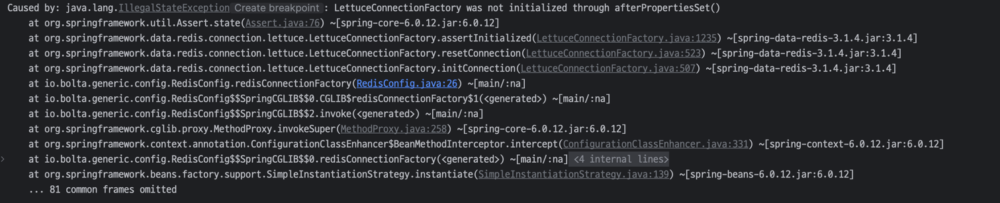
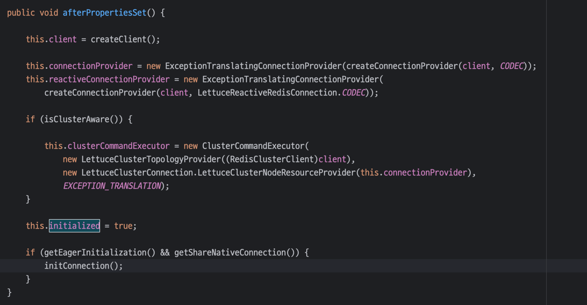

### 셋팅
lettuce 사용으로 RedisConnectionFactory를 Bean으로 등록했다.

```java
@Bean
public RedisConnectionFactory redisConnectionFactory() {
    return new LettuceConnectionFactory(redisProperties.getHost(),
        redisProperties.getPort());
}
```

정상적으로 시스템이 동작했지만, 레디스가 정상 연결되지 않았음에도 애플리케이션이 정상으로 동작했다.

테스트 커넥션이 필요하다고 느꼈다. 왜냐하면 애플리케이션이 배포 후에 request를 받은 후 에러가 발생하면 늦었다고 생각했다.

애플리케이션 배포를 실패할 수 있도록 빠른실패를 하는 설정을 추가하면 빠른실패를 할 수 있어 좋겠다.

```java
@Bean
public RedisConnectionFactory redisConnectionFactory() {
    var lettuceConnectionFactory = new LettuceConnectionFactory(redisProperties.getHost(),
        redisProperties.getPort());

    lettuceConnectionFactory.initConnection();
    return lettuceConnectionFactory;
}
```



하지만 에러가 발생했는데, afterPropertiesSet()에 초기화를 하지 않았다며 에러 메시지를 뱉었다.

왜냐면 LettuceConnectionFactory객체가 아직 초기화 되지 않았는데(), test connection을 하려고 해서 생긴 문제로 보인다.

알고보니 initConnection()는 LettuceConnectionFactory Bean 내부에서 사용중인 메서드였는데,



위 사진은 LettuceConnectionFactory의 afterPropertiesSet() 메서드다. 최하단 조건문을 보면, 옵션에 따라 initConnection()을 실행시키는걸로 보인다.

```java
@Bean
public RedisConnectionFactory redisConnectionFactory() {
    var lettuceConnectionFactory = new LettuceConnectionFactory(redisProperties.getHost(),
        redisProperties.getPort());
    lettuceConnectionFactory.setEagerInitialization(true);

    return lettuceConnectionFactory;
}
```

직접 초기화하려고 하지 않았다. redisConnectionFactory빈에서 afterPropertiesSet()에서 Eager 초기화를 지원하니, `setEagerInitialization(true)`를 설정해주는 방법으로 진행했다.
